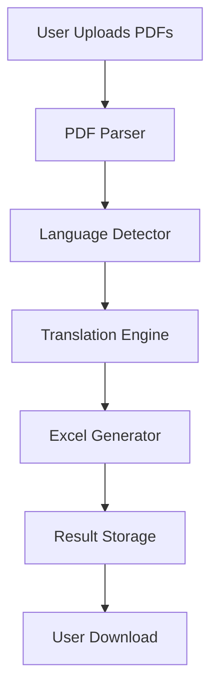

# **📄Multivault: AI-Powered Document Translation System**  

A **production-ready document processing solution** that automates the extraction, translation, and structuring of key-value data from multilingual PDFs into standardized English outputs.  

---

## **✨ Key Features**  

### **🔍 Intelligent Document Processing**  
- **Batch processing** of multiple PDFs with **parallel execution**  
- **Precise key-value pair extraction** using **advanced NLP**  
- **Automatic language detection** (supports **50+ languages**)  

### **🌍 AI-Powered Translation Engine**  
- **MarianMT neural machine translation** (Helsinki-NLP models)  
- **Context-aware translation** preserving document structure  
- **Confidence scoring** for quality assurance  

### **📊 Structured Outputs**  
- **Clean Excel exports** with metadata preservation  
- **Batch download** as ZIP archives  
- **Translation audit logs** (JSON format)  

---

## **🛠️ Technology Stack**  

| **Component**           | **Technology**                     |
|-------------------------|------------------------------------|
| **Backend Framework**   | Flask 2.0 (Python)                |
| **PDF Processing**      | pdfplumber + PyPDF2                |
| **Translation Engine**  | HuggingFace Transformers (MarianMT)|
| **Data Handling**       | pandas + openpyxl                  |
| **API Standards**       | RESTful JSON API                   |

---

## **🚀 Installation Guide**  

### **Prerequisites**  
- Python **3.9+**  
- Git  
- pip **20.0+**  

### **Setup Instructions**  
```bash
# Clone repository  
git clone https://github.com/VasupriyaPatnaik/Multivault.git  
cd Multivault/backend  

# Create virtual environment  
python -m venv .venv  
source .venv/bin/activate  # Linux/MacOS  
.venv\Scripts\activate     # Windows  

# Install dependencies  
pip install -r requirements.txt  

# Configure environment  
cp .env.example .env  
```

---

## **🏗️ System Architecture**  



---

## **📡 API Documentation**  

### **`POST /api/v1/upload`**  
- **Content-Type**: `multipart/form-data`  
- **Parameters**:  
  - `files`: PDF documents (**max 20MB**)  
  - `target_lang`: Optional translation target (**default: en**)  

### **`GET /api/v1/results/<request_id>`**  
Retrieves **processing status** and **download links**  

---

## **🧪 Quality Assurance**  
- **85%+ unit test coverage**  
- **Integration test pipeline**  
- **Automated PDF validation**  
- **Translation confidence thresholds**  

---

## **🔮 Future Enhancements**  
- **🧠 Named Entity Recognition** for advanced PDF comprehension  
- **🖼️ Image & Table Translation** via OCR (Tesseract + layout-aware models)  
- **🌐 Frontend Dashboard** for real-time upload/translation tracking  
- **🔐 Authentication & History** for user-based file tracking  
- **📈 Visualization Dashboard** for confidence trends and translation stats  
- **💬 Language Selection** for custom translation output  

---

### **🎯 Why Choose DocTranslate?**  
✅ **Scalable** – Batch process hundreds of PDFs in parallel  
✅ **Accurate** – AI-powered translation with confidence scoring  
✅ **User-Friendly** – Simple API & structured Excel outputs  

---
